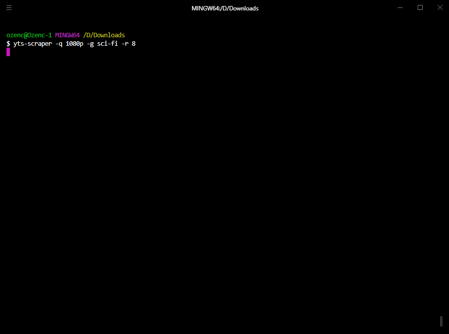

# Torrent files by YTS Scraper

## This is the collection of 50K+ .torrent file (1080P Quality)
Just download IMDB Rating List folder to your computer
No need to use **yts-scraper** by yourself.
All files are update to 21-11-2024

<text color=red>ERROR</text>

## Downloading torrent content is illegal; please be aware

ဒီဖိုင်လေးကို လုပ်ဖြစ်တဲ့ ရည်ရွယ်ချက်ကတော့ movie recap သမားတွေ ဖြစ်ဖြစ် 
ရုပ်ရှင် ဝါသနာ အိုးတွေဖြစ်ဖြစ် မူရင်း ဗီဒီယိုကို အလွယ်တကူ ရှာပြီး မြန်မြန်ဆန်ဆန် 
ဒေါင်းနိုင်ဖို့အတွက်ပါ။ တော်ရန့် ဖိုင်တွေ တင်တဲ့ ဆိုဒ် ဆိုတာက Ads တွေ 
အရမ်းများသလို နားမလည်ရင်မသုံးချင်လောက်အောင် စိတ်ပျက်ဖို့ ကောင်းတဲ့ ဆိုဒ်တွေပါ။ 

အပေါ်က ပြထားတဲ့ folder တခုချင်းစီကို ဒေါင်းပြီးတော့ သိမ်းထားလိုက်ယုံနဲ့
လိုအပ်တဲ့အချိန်မှာ တန်းပြီး ဒေါင်းယုံပါဘဲ။ 

တလ တခါလောက် update ဖြစ်အောင်တော့ လုပ်ဖို့ ကြိုးစားပါဦးမယ်။

### Folder List

**IMDB Rating 0+** 		- include 339 movies .torrent file

**IMDB Rating 1+** 		- include 118 movies .torrent file

**IMDB Rating 2+** 		- include 996 movies .torrent file

**IMDB Rating 3+** 		- include 3016 movies .torrent file

**IMDB Rating 4+** 		- include 6374 movies .torrent file

**IMDB Rating 5+** 		- include 12321 movies .torrent file

**IMDB Rating 6+** 		- include 17288 movies .torrent file

**IMDB Rating 7+** 		- include 10051 movies .torrent file

**IMDB Rating 8+** 		- include 1177 movies .torrent file

**IMDB Rating 9+** 		- include 21 movies .torrent file

## Description
**yts-scraper** is a command-line tool for downloading .torrent files from YTS. 
It requires Python 3.0+.
Note that this tool does not download the contents of a torrent file but downloads files with .torrent extension.
You should use a Torrent client to open these files. 

## Installation
Make sure that setuptools is installed on your system before running setup.

Linux:
`sudo apt-get install python3-setuptools`

Windows:
`pip install setuptools`

Then you can run `python setup.py install` to install YTS-Scraper on your system.

## Usage
To start scraping run:

`yts-scraper [OPTIONS]`

For instance, this command downloads every 1080p sci-fi movie and their posters with an IMDb score of 8 or higher, and store them in rating>genre structured subdirectories.

`yts-scraper -q 1080p -g sci-fi -r 8 -c rating-genre -b`

## Options

| Commands                  | Description                                                                                                                                                           |
|---------------------------|-----------------------------------------------------------------------------------------------------------------------------------------------------------------------|
|`-h` or `--help`           |Prints help text. Also prints out all the available optional arguments.                                                                                                |
|`-o` or `--output`         |Output directory                                                                                                                                                       |
|`-b` or `--background`     |Append "-b" to download movie posters. This will pack .torrent file and the image together in a folder.                                                                |
|`-m` or `--multiprocess`   |Append -m to download using multiprocessor. This option makes the process significantly faster but is prone to raising flags and causing server to deny requests.      |
|`--csv-only`               |Append --csv-only to log scraped data ONLY to a CSV file. With this argument torrent files will not be downloaded.                                                     |
|`-i` or `--imdb-id`        |Append -i to append IMDb ID to filename.                                                                                                                               |
|`-q` or `--quality`        |Video quality. Available options are: "all", "720p", "1080p", "3d"                                                                                                     |
|`-g` or `--genre`          |Movie genre. Available options are: "all", "action", "adventure", "animation", "biography", "comedy", "crime", "documentary", "drama", "family", "fantasy", "film-noir", "game-show", "history", "horror", "music", "musical", "mystery", "news", "reality-tv", "romance", "sci-fi", "sport", "talk-show", "thriller", "war", "western".|
|`-r` or `--rating`         |Minimum rating score. Enter an integer between 0 and 9.                                                                                                                |
|`-s` or `--sort-by`        |Download order. Available options are: "title", "year", "rating", "latest", "peers", "seeds", "download_count", "like_count", "date_added"                             |
|`-c` or `--categorize-by`  |Creates a folder structure. Available options are: "rating", "genre", "rating-genre", "genre-rating"                                                                   |
|`-y` or `--year-limit`     |Filters out movies older than the given value.                                                                                                                         |
|`-p` or `--page`           |Can be used to skip ahead an amount of pages.                                                                                                                          |

## Disclaimer
This is a proof of concept tool built mainly to practice programming.
The tool downloads thousands of torrent files in bulk and some of these torrent files might be leading to copyrighted material.
Although the downloaded files are not the contents themselves, accessing or storing these files might still be illegal in some parts of the world. So, take great care when using this tool and make sure that it is legal.
